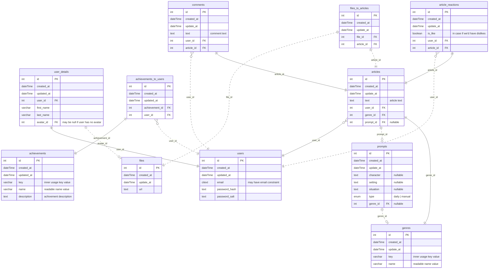

# Writorium

## ℹ️ General Info

This is the repository responsible for Writorium's apps.

## 🏭 Applications

- [Backend](./backend) — Writorium's application backend.

  _To work properly, fill in the **`.env`** file. Use the **`.env.example`** file as an example._

- [Frontend](./frontend) — Writorium's application frontend.

  _To work properly, fill in the **`.env`** file. Use the **`.env.example`** file as an example._

- [Shared](./shared) — Writorium's application common modules for reuse.

## 🖍 Requirements

- [NodeJS](https://nodejs.org/en/) (18.x.x);
- [NPM](https://www.npmjs.com/) (9.x.x);
- [PostgreSQL](https://www.postgresql.org/) (15.4)
- run **`npx simple-git-hooks`** at the root of the project, before the start (it will set the [pre-commit hook](https://www.npmjs.com/package/simple-git-hooks) for any commits).

## 🏃‍♂️ Simple Start

1. **`npm install`** at the root
2. Fill ENVs
3. **`npx simple-git-hooks`** at the root
4. **`cd backend && npm run migrate:dev`**
5. **`cd frontend && npm run start:dev`** then **`cd backend && npm run start:dev`**
6. Enjoy <3

**PS:** If you're facing such kind of strange errors from eslint-plugin


Then you may fix it with such solution (for VS Code IDE):

1. At projects root create `.vscode` folder
2. Place there `settings.json` file
3. Add `eslint.workingDirectories` rule in `settings.json` file

```
  {
    "eslint.workingDirectories": ["./", "./backend", "./frontend", "./shared"]
  }
```


## 🏗 Architecture

### 🛖 Application Schema

TBA

### 💽 DB Schema



### 🌑 Backend

- [Fastify](https://www.fastify.io/) — a backend framework.
- [Knex](https://knexjs.org/) — a query builder.
- [Objection](https://vincit.github.io/objection.js/) — an ORM.

### 🌕 Frontend

- [React](https://reactjs.org/) — a frontend library.
- [Redux](https://redux.js.org/) + [Redux Toolkit](https://redux-toolkit.js.org/) — a state manager.

### 🥊 Code quality

- **[quality-criteria rules](https://github.com/BinaryStudioAcademy/quality-criteria/blob/production/src/javascript.md)** - rules that should be **followed** during application development.
- [simple-git-hooks](https://www.npmjs.com/package/simple-git-hooks) — a tool that lets you easily manage git hooks.
- [lint-staged](https://www.npmjs.com/package/lint-staged) — run linters on git staged files.
- [dangerjs](https://danger.systems/js/) — automate common code review chores.
- [commitlint](https://commitlint.js.org/) — helps your team adhere to a commit convention.
- [editorconfig](https://editorconfig.org/) — helps maintain consistent coding styles for multiple developers working on the same project across various editors and IDEs.
- [prettier](https://prettier.io/) — an opinionated code formatter.
- [ls-lint](https://ls-lint.org/) — file and directory name linter.
- [eslint](https://eslint.org/) — find problems in your JS code.
- [stylelint](https://stylelint.io/) — find and fix problems in your CSS code.

## 🧑‍💻 CI

### 🗞 Git

#### 🏅 Pull Request flow

```
<project-prefix>-<issue-number>: <ticket-title>
```

##### Example

- `wr-5: Add Articles page`

#### 🌳 Branch flow

```
<type>/<project-prefix>-<issue-number>-<short-desc>
```

##### Types

- task
- fix

##### Examples

- `task/wr-5-add-articles-page`
- `task/wr-12-add-create-article-flow`
- `fix/wr-16-writer-articles-display`

#### 🗂 Commit flow

```
<project-prefix>-<issue-number>: <modifier> <description>
```

##### Modifiers

- `+` (add)
- `*` (edit)
- `-` (remove)

##### Examples

- `wr-5: + articles feed page`
- `wr-12: * create article form`
- `wr-16: - other writers articles on my articles tab`

## 📦 CD

[Handled](.github/workflows/cd.yml) by [GitHub Actions](https://docs.github.com/en/actions).
